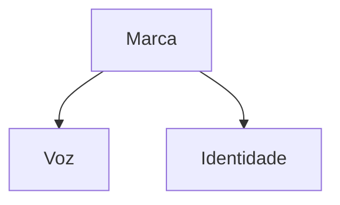

# Identidade

## Frase-marca

"Marca de exemplo para testes do Companion."

Reciprocidade: [[index]] e [[voz]].

Tag inline: #exemplo e #voz-editorial.

> [!warning] Atenção
> Este é um brain de fixture do Playwright.

