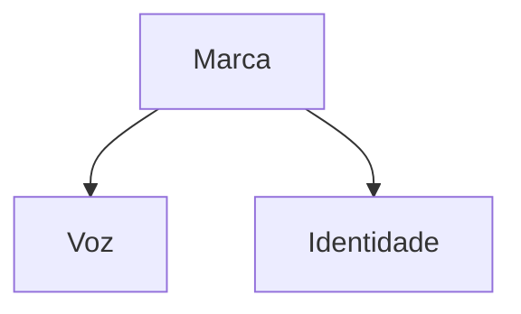

# Identidade

## Em uma linha

Marca de exemplo para testes do Companion.

## A marca

### Aposto

Sample Project, marca de exemplo para testes do Companion.

### Parágrafo de apresentação

Sample Project valida fluxos editoriais do Companion em um projeto pequeno. A fixture cobre edição de páginas do brain, links internos, metadados de conteúdo, Topic Clusters e renderização de blocos visuais. Seu posicionamento é deliberadamente simples: provar que a interface preserva Markdown autoral, atualiza arquivos do projeto e mostra decisões de forma navegável.

## Frase-marca

"Marca de exemplo para testes do Companion."

## Posicionamento

- Projeto de teste para governança editorial.
- Foco em clareza, links internos e persistência.
- Conteúdo pequeno para facilitar inspeção manual.
- Uso de dados fictícios sem reivindicação de mercado.
- Navegação pensada para validar páginas reais do brain.

Reciprocidade: [[index]] e [[voice]].

Tag inline: #exemplo e #voz-editorial.

> [!warning] Atenção
> Este é um brain de fixture do Playwright.

